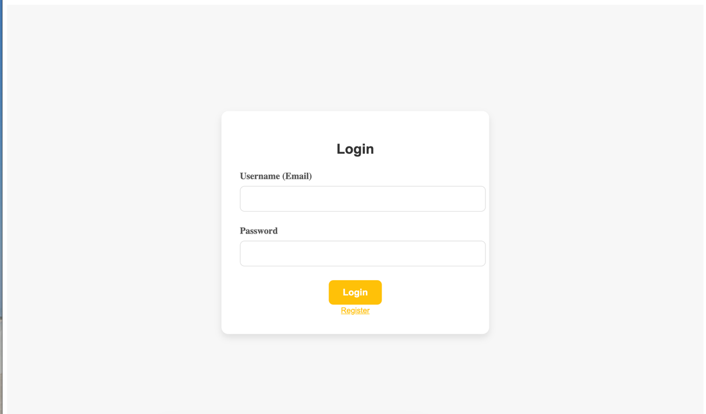
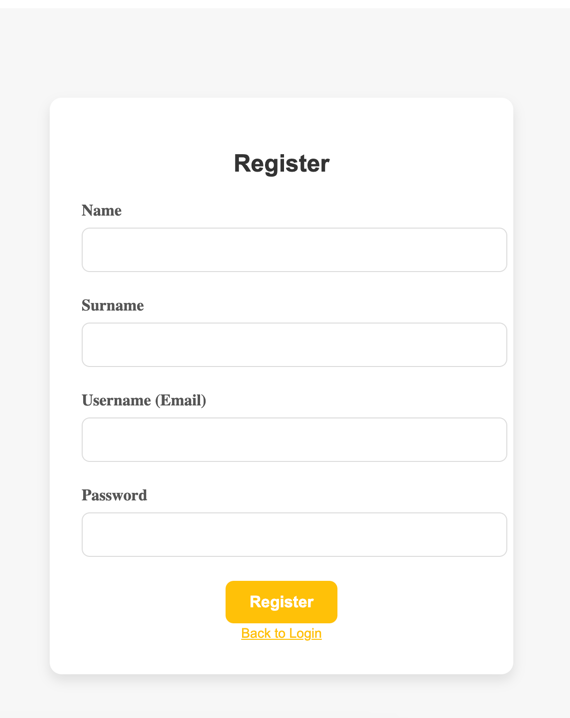
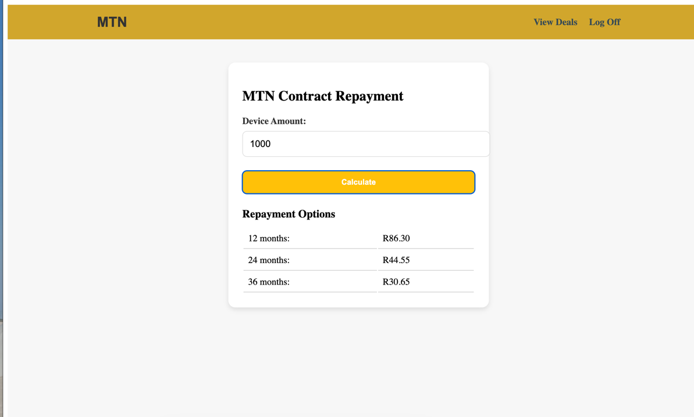

# MTN Contract Repayment System

# Front-end





## Description
The MTN Contract Repayment System is a comprehensive web application designed to manage contract repayments effectively. This solution combines a robust Java Spring Boot backend with a dynamic Angular frontend, integrating Redis caching to enhance performance and data management efficiency. The system is engineered to serve both API endpoints and static frontend files from a single Spring Boot application, simplifying deployment and operations.

## Prerequisites
- Java 17
- Maven
- Node.js (v22.3.0)
- npm (v10.8.1)
- Redis Server

## Technologies
- **Spring Boot 3.2.7**: Framework for creating stand-alone, production-grade Spring based Applications.
- **Java JDK 17**: The development environment for building applications and components using the Java programming language.
- **Spring Security**: Provides authentication and authorization mechanisms.
- **Spring Data JPA**: Facilitates database interactions.
- **H2 Database**: In-memory database used for development and testing purposes.
- **JWT (JSON Web Tokens)**: Ensures secure communication between the client and the server.
- **Angular**: Frontend framework for building dynamic web interfaces.
- **Swagger**: Tool for documenting APIs exposed by a Spring Boot application.
- **Redis**: An open-source (BSD licensed), in-memory data structure store, used as a database, cache, and message broker.

## Installation and Setup
1. **Clone the repository**:

2. **Install Redis**:
   - **Windows**: Download and install Redis from [Redis Windows Port by Microsoft](https://github.com/microsoftarchive/redis/releases).
   - **macOS** (using Homebrew):
     ```bash
     brew install redis
     brew services start redis
     ```
   - **Ubuntu**:
     ```bash
     sudo apt update
     sudo apt install redis-server
     sudo systemctl enable redis-server.service
     ```

3. **Build the project**:
   Navigate to the root directory of the project and run:
```bash
## Build the app
mvn clean install

## Run the Spring Boot application:
mvn spring-boot:run

## Generate JaCoCo report
mvn test jacoco:report
```

## Running Redis Server

#### Ensure Redis is running before starting the application to utilize caching:

Windows: Run Redis using the installed executable.
macOS and Ubuntu: Redis will start automatically if you've set it up with Homebrew/systemctl as described.
Security Features

The application utilizes Spring Security with JWT for securing REST API endpoints. This setup ensures that all transactions are authenticated and authorized, providing a secure environment for operation.

## API Documentation

Swagger is integrated to automatically generate live documentation for all exposed APIs. This can be accessed at http://localhost:8080/swagger-ui.html once the application is running. It provides a detailed view of all REST endpoints, including the expected parameters and the response models.

## Monitoring

Spring Boot Actuator is enabled, providing essential management and monitoring capabilities accessible at http://localhost:8080/actuator. It offers health, info, and metric data for the application.